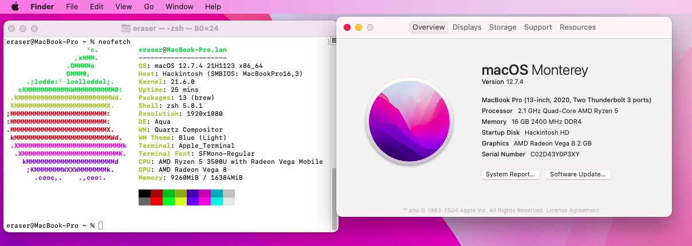
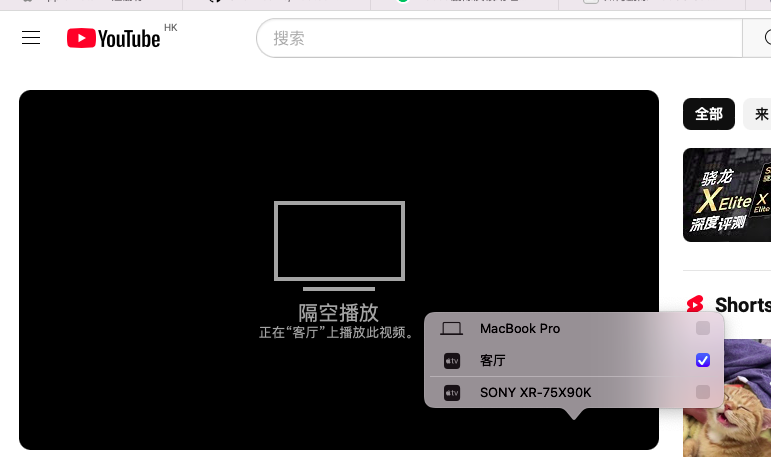
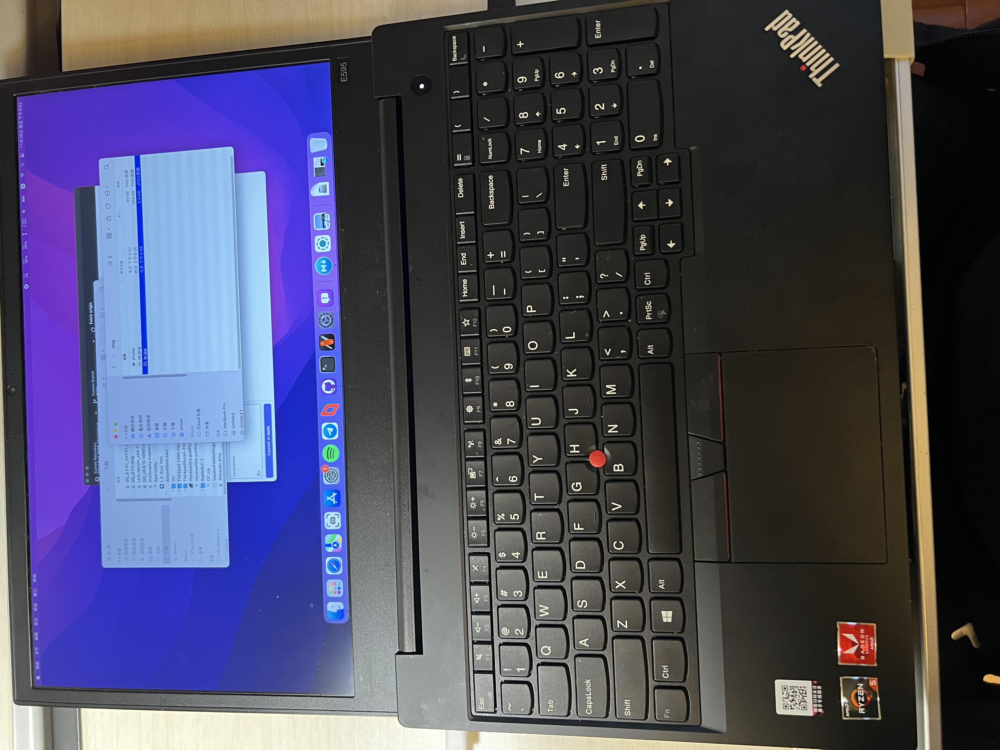

# ThinkPad-E595-Hackintosh
 Hackintosh for ThinkPad E595/E495. Also works for T495 with a minor change of Audio-related stuff.
 

## Prerequisites
| **My Hardware**      |                      |
|----------------------|----------------------|
| Laptop Model         | ThinkPad E595        |
| CPU                  | AMD Ryzen 5 3500U 4c8t |
| Graphics             | Integrated AMD Radeon Vega 8(set to 2GB) |
| Wi-Fi Card           | AX200                |
| SSD                  | SN580 512GB          |
| Audio                | Conexant CX8070      |
| macOS   | 12.0-14.7 |

| **Feature**          | **Status**           |
|----------------------|----------------------|
| Keyboard              | Working              |
| Trackpad              | Working              |
| USB Ports             | Working              |
| GPU Acceleration      | Working              |
| Wi-Fi                | Working              |
| Bluetooth            | Working              |
| Audio                | Partially Working(see below)             |
| AirPlay              | Working              |
| Sidecar              | Not Working             |
| HDMI                 | Untested             |
| Type-C Display       | Untested             |
| Fingerprint          | Won't Work at All    |
| AirDrop              | Won't Work at All    |
| iPhone Mirroring     | Won't Work at All    |
| DRM-related stuff    | Won't Work at All    |

## Fix Broken Audio
After rebooting from Windows, we've noticed that Audio will be broken even though everything works fine on the Kext side. You need to use either way to fix it, see below.

- Completely remove Windows(recommended, fuck MSFT)
- After shutting down, reboot to bios, choose Power->Disable built-in battery, then plug in the AC adapter and boot to macOS
- Physically disconnect the built-in battery
- Cool down for a few hours before switching to macOS

## Installation Steps
1. Clone or download this repository.
2. Place the `EFI` folder into your bootable USB drive for macOS installation.
3. Boot from the USB drive and install macOS as per standard procedures.

## BIOS Settings
- Disable: TPM, Secure Boot, Memory Protection
- Enable: UEFI Only, AMD Virtualization, Hyper Threading
- Set VRAM to no less than 1GB, or there might be some issues with Metal

## Further Improvements
- ~~1. Audio support from AppleALC~~
- ~~2. Power Management~~
- 3. Readme in Chinese
